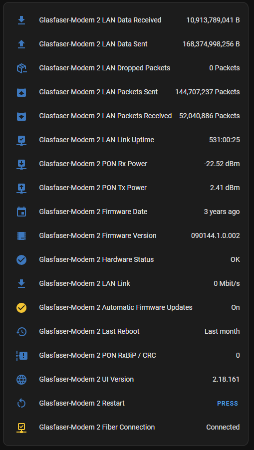

# Telekom Glasfaser-Modem 2

[![GitHub Release][releases-shield]][releases]
[![GitHub Activity][commits-shield]][commits]
[![License][license-shield]](LICENSE)

_Home Assistant community integration to integrate with the [Telekom Glasfaser-Modem 2](https://www.telekom.de/zuhause/geraete-und-zubehoer/wlan-und-router/glasfaser-modem-2)._

## Overview

## Sensors
### LAN
- Data Sent (Bytes)
- Date Received (Bytes)
- Packets Sent
- Packets Received
- Dropped Packets
- Link Uptime
- Link Speed
    - Note: Displays 0 for 2.5G connections

### PON
- Rx Power
- Tx Power
- BXBIP / CRC
- Fiber Connected

### Firmware
- Firmware Version
- Firmware release date
- UI Version
- Automatic Updates Enabled

### Other
- Last Reboot
  - Only reboots via the modem's reboot button are noted
- Hardware Status

## Buttons
Name | Description
---- | ----------
Restart | Restarts the modem

## Installation

### Preconditions
For this integration to work, the modem must be accessible from the Home Assistant host. This requires special NAT rules to be configured on the router, which is unfortunately not possible with most home routers. (Advanced routers such as OPNsense, pfSense or similar are required for this)

You can use this link to check whether your modem can be reached (if you are using the default IP address):
http://192.168.100.1/ONT/client/html/content/overview/status.html

**If the modem is not reachable, you cannot use this integration!**

### Method 1: Custom Repository (Recommended)
Click here:

**OR**

Add `https://github.com/Netzwerkfehler/hass-GFM2` as a [custom repository](https://hacs.xyz/docs/faq/custom_repositories/) in HACS.

then

1. Restart Home Assistant
1. In the HA UI go to "Configuration" -> "Integrations" click "+" and search for "Telekom Glasfaser-Modem 2"

### Method 2: Manual
1. Using the tool of choice open the directory (folder) for your HA configuration (where you find `configuration.yaml`).
1. If you do not have a `custom_components` directory (folder) there, you need to create it.
1. In the `custom_components` directory (folder) create a new folder called `gfm2`.
1. Download _all_ the files from the `custom_components/gfm2/` directory (folder) in this repository.
1. Place the files you downloaded in the new directory (folder) you created.
1. Restart Home Assistant
1. In the HA UI go to "Configuration" -> "Integrations" click "+" and search for "Telekom Glasfaser-Modem 2"

## Configuration is done in the UI

Only the IP address of the modem is required as a configuration parameter in this integration. It is preset to "192.168.100.1" and does not normally need to be changed.

## Internals
This integration queries these endpoints:
Method | Endpoint
------ | --------
GET    | /ONT/client/data/Status.json
GET    | /ONT/client/data/FirmwareUpdate.json
GET    | /ONT/client/data/Reboot.json
POST   | /ONT/client/data/Reboot.json

[commits-shield]: https://img.shields.io/github/commit-activity/y/Netzwerkfehler/hass-GFM2.svg?style=for-the-badge
[commits]: https://github.com/Netzwerkfehler/hass-GFM2/commits/main
[exampleimg]: example.png
[license-shield]: https://img.shields.io/github/license/Netzwerkfehler/hass-GFM2.svg?style=for-the-badge
[releases-shield]: https://img.shields.io/github/release/Netzwerkfehler/hass-GFM2.svg?style=for-the-badge
[releases]: https://github.com/Netzwerkfehler/hass-GFM2/releases
